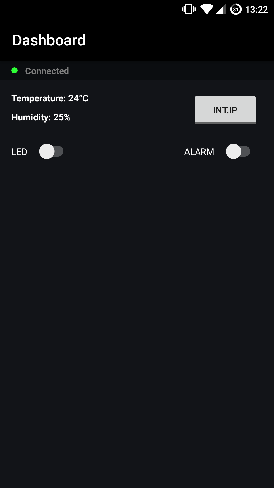
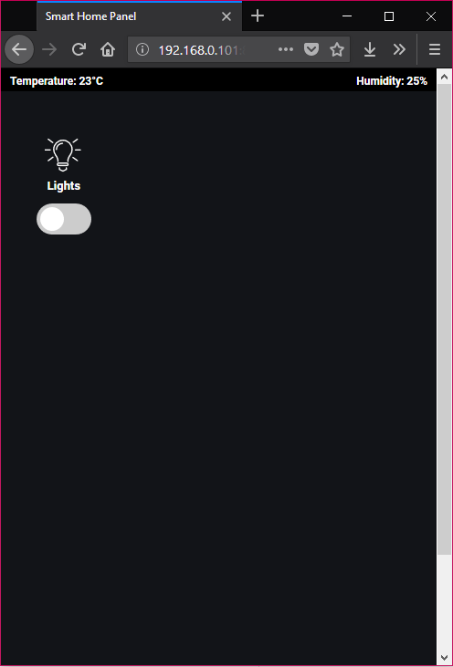

# Smart Home

This is a project that I work with on my spare time to learn using my Raspberry Pi 3. The idea is to connect various modules and interact with them over the web.

A server made in Node.js communicates with the GPIO ports in use and emits values to connected clients. A web interface or an Android app can connect to the server and read/write to the ports. As of now, a temperature sensor, motion sensor, piezo buzzer, IR transceiver and LEDs have been connected to the pi. With the IR transmitter I can turn on/off my desk lamp that uses an RGB bulb with IR.

## Screenshots
<figure style="float:left;">
  
  
  <figcaption><i>Version 1: A simple prototype for testing the functionality. The design will be changed in the future.</i></figcaption>
</figure>
