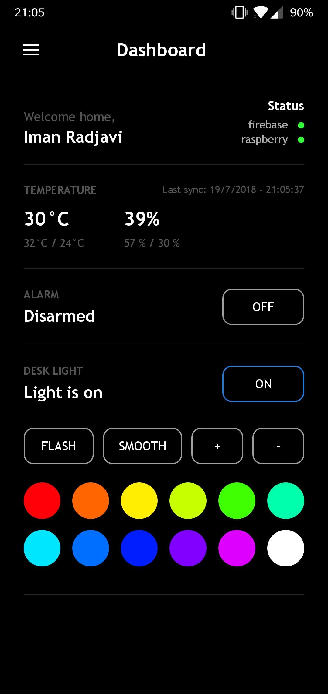

# Smart Home

This is a project that I work with on my spare time. Using Firebase, I have connected my Raspberry Pi 3 to a database where I can store information such as temperature, humidity, button states etc. This way, I can connect my Android app to Firebase and use it to control my home.

In the first version, I used websockets (socket.io) to control the pi, but I migrated to Firebase because of all the features they include as well as being very convenient.

## Screenshots
### Current version

### First version

A simple prototype to test the functionality.

    
    

Played around with Electron JS and created a simple desktop app and updated the design for the web app at the same time.

    
    

