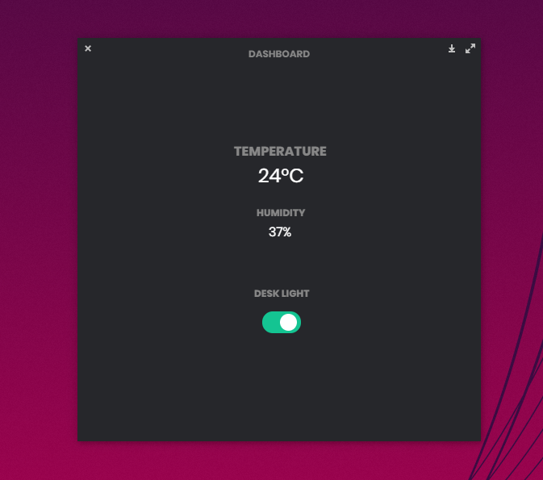
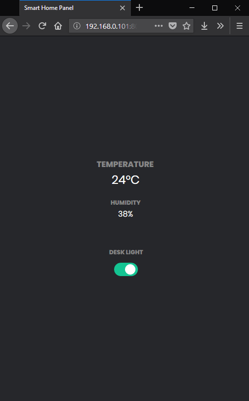

# Smart Home

This is a project that I work with on my spare time to learn using my Raspberry Pi 3 as well as new languages such as Node JS and Electron JS. The idea is to connect various modules to the pi and interact with them over the web.

A server made in Node.js communicates with the GPIO ports in use and emits values to connected clients. A web interface (Node JS), mobile app (Android) or a desktop app (Electron JS) can connect to the server and read/write to the ports. As of now, a temperature sensor, motion sensor, piezo buzzer, IR transceiver and LEDs have been connected to the pi. With the IR transmitter I can turn on/off my desk lamp that uses an RGB bulb with IR.

## Screenshots
### First prototype

A simple prototype to test the functionality.

    
    

### Design update

Played around with Electron JS and created a simple desktop app and updated the design for the web app at the same time.

    
    

